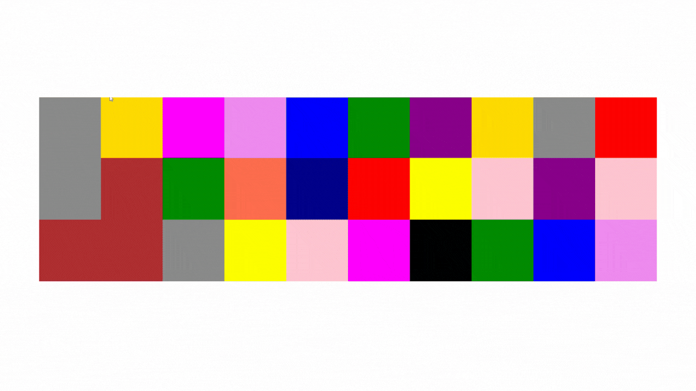

# 🎨 Random Color Changing Project

<h1>  This project is developed using the React library, aiming to demonstrate the use of Hooks and state management techniques. </h1>

# 🛠️ Features

<h2>Random Color Refresh:</h2> <h4>Each time the page is refreshed, the boxes load with random colors.</h4>

<h2>Interactive Color Change:</h2> <h4> When a user clicks on any box, it changes to a new random color.</h4>

<h2>Code Structure:</h2>  <h4>A do-while loop ensures the assignment of random colors.</h4>

<h1> This project is designed around React's Hooks features and serves as a practical example to enhance interactive user experiences. </h1>

# Live Demo

